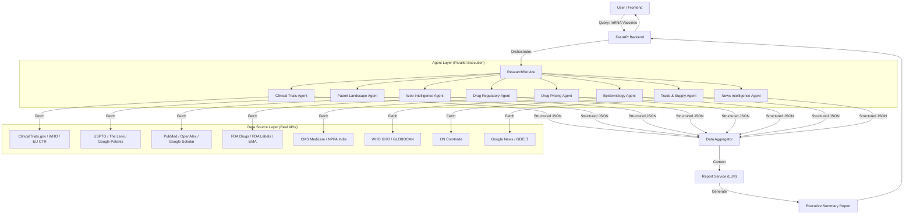

# Project Architecture & Agent Data Source Map

## 1. Project Overview
**System Name:** Pharma Intelligence Platform
**Goal:** To provide real-time, multi-dimensional strategic intelligence for the pharmaceutical industry by aggregating data from 35+ global sources.

**Core Value Proposition:**
Unlike generic search engines, this system uses **Specialized AI Agents** to fetch *real* structured data (Clinical Trials, Patents, Regulatory, Trade, etc.) and then uses a **Synthesis LLM** to generate decision-grade executive reports.

---

## 2. High-Level Architecture

---

## 3. Detailed Agent & Data Source Breakdown

### 1. Clinical Trials Agent
*   **Role:** Tracks the development pipeline of drugs and therapies.
*   **Real Data Sources:**
    *   **ClinicalTrials.gov (USA):** Fetches active, recruiting, and completed trials.
    *   **WHO ICTRP (Global):** Scrapes global trial registries (placeholder for complex scraping).
    *   **EU CTR (Europe):** Fetches European clinical trial data.
*   **Data Pulled:** Trial ID (NCT), Title, Phase (1-4), Status (Recruiting/Completed), Sponsor, Conditions.

### 2. Patent Landscape Agent
*   **Role:** Analyzes intellectual property rights and innovation trends.
*   **Real Data Sources:**
    *   **USPTO (USA):** Fetches granted patents and applications via Open Data Portal.
    *   **The Lens (Global):** (Requires Key) Fetches global patent families.
    *   **Google Patents:** Used for URL linking.
*   **Data Pulled:** Patent Number, Title, Assignee (Owner), Filing Date, Status (Active/Pending/Expired).

### 3. Web Intelligence Agent (Scientific Literature)
*   **Role:** Gathers scientific evidence and research findings.
*   **Real Data Sources:**
    *   **PubMed (NCBI):** Fetches biomedical literature, abstracts, and metadata.
    *   **OpenAlex:** Fetches open-access scientific works and citation data.
*   **Data Pulled:** Article Title, Authors, Journal, Publication Date, DOI, Abstract.

### 4. Drug Regulatory Agent
*   **Role:** Monitors approval status and regulatory compliance.
*   **Real Data Sources:**
    *   **openFDA (Drugs):** Fetches NDA/ANDA approval history and marketing status.
    *   **openFDA (Labels):** Fetches official drug labels and safety warnings.
*   **Data Pulled:** Application Number, Brand Name, Sponsor, Marketing Status (Rx/OTC), Approval Date.

### 5. Drug Pricing Agent
*   **Role:** Tracks pricing trends and reimbursement data.
*   **Real Data Sources:**
    *   **CMS (Medicare):** Fetches spending and utilization data for drugs in the US.
    *   **NPPA (India):** (Scraper) Fetches ceiling prices for essential medicines.
*   **Data Pulled:** Drug Name, Average Spending per Dosage Unit, Total Spending.

### 6. Epidemiology Agent
*   **Role:** Analyzes disease burden and population health trends.
*   **Real Data Sources:**
    *   **WHO GHO (Global Health Observatory):** Fetches health indicators (mortality, prevalence).
*   **Data Pulled:** Indicator Name, Region/Country, Year, Numeric Value.

### 7. Trade & Supply Chain Agent
*   **Role:** Monitors global movement of pharmaceutical goods.
*   **Real Data Sources:**
    *   **UN Comtrade:** Fetches import/export volumes and values by HS Code (e.g., 3004 for Medicaments).
*   **Data Pulled:** Commodity Code, Reporter Country, Partner Country, Trade Value (USD), Net Weight.

### 8. News Intelligence Agent
*   **Role:** Tracks real-time market sentiment and breaking news.
*   **Real Data Sources:**
    *   **Google News (RSS):** Fetches latest headlines and articles.
    *   **GDELT Project:** Fetches global event data and sentiment signals.
*   **Data Pulled:** Article Title, Source, Publication Date, URL, Sentiment Score.

---

## 4. The "Strict Real Data" Pipeline

To ensure integrity, the system operates on a **Strict Real Data** policy:
1.  **No Fallbacks:** If a real API fails (e.g., USPTO is down), the agent returns an explicit "No Data" error. It does **not** generate fake data.
2.  **No Hallucination:** The Report Service is strictly instructed to write "Data not available" if the agents return empty results, rather than inventing numbers.
3.  **Transparency:** Every section of the final report is based 100% on the JSON data returned by the agents listed above.

## 5. Technology Stack
*   **Backend:** Python (FastAPI)
*   **Frontend:** React.js
*   **AI/LLM:** OpenAI GPT-4o (for synthesis only, not for data generation)
*   **Async Processing:** `asyncio` & `aiohttp` for parallel data fetching.
